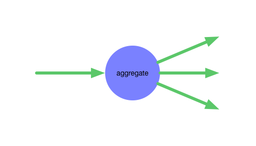

[](https://www.npmjs.com/package/kronos-step-aggregate)
[](https://github.com/Kronos-Integration/kronos-step-aggregate)
[](http://travis-ci.org/Kronos-Integration/kronos-step-aggregate)
[](https://www.bithound.io/github/Kronos-Integration/kronos-step-aggregate)
[](http://codecov.io/github/Kronos-Integration/kronos-step-aggregate?branch=master)
[](https://codeclimate.com/github/Kronos-Integration/kronos-step-aggregate)
[](https://github.com/Kronos-Integration/kronos-step-aggregate/issues)
[](https://david-dm.org/Kronos-Integration/kronos-step-aggregate)
[](https://david-dm.org/Kronos-Integration/kronos-step-aggregate#info=devDependencies)
[](http://inch-ci.org/github/Kronos-Integration/kronos-step-aggregate)
[](https://npmjs.org/package/kronos-step-aggregate)
[](http://commitizen.github.io/cz-cli/)


Dispatches a request to several endpoints and aggregates the responses into one response



install
=======

With [npm](http://npmjs.org) do:

```shell
npm install kronos-step-aggregate
```

license
=======

BSD-2-Clause
